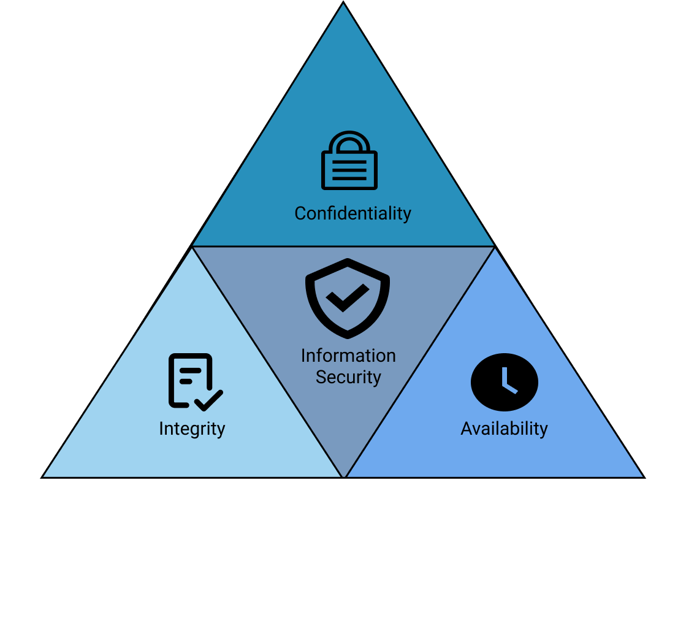

# CIA Triad

The CIA triad is a widely used model for information security. It stands for Confidentiality, Integrity, and Availability, and it represents the three main goals of information security:
{ width="350" align=right }

### Confidentiality 

Confidentiality refers to the protection of sensitive or confidential information from unauthorized access or disclosure. Confidentiality ensures that only authorized individuals can access and use the information, and it prevents others from reading, copying, or modifying it.

### Integrity

Integrity refers to the accuracy and consistency of information over its entire lifecycle. Integrity ensures that the information is not corrupted, modified, or destroyed in an unauthorized or accidental manner. Maintaining integrity helps to ensure that the information is reliable and trustworthy.

### Availability

Availability refers to the ability of authorized users to access the information when needed. Availability ensures that the information is accessible and usable when required, and it prevents disruptions or delays that could affect its usefulness.
