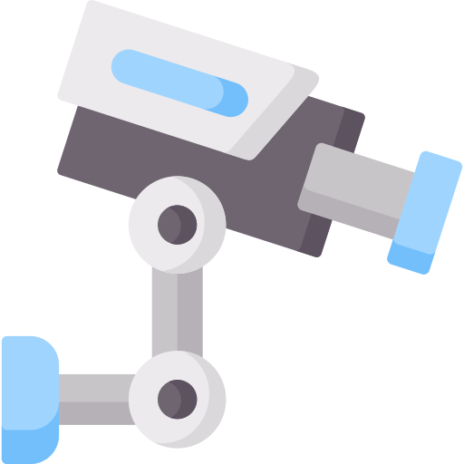

# Security Controls

Security controls are safeguards or countermeasures that are put in place to protect information and information systems from various security threats and risks. These controls can be administrative, technical, or physical in nature, and they serve to reduce the likelihood and impact of security incidents.

### Administrative Controls

{ width="80" align=left }
Administrative controls are policies, procedures, and guidelines that organizations establish to manage their security risks. These controls include security awareness training, background checks, access control policies, and incident response plans. Administrative controls are important because they establish a framework for managing security risks and ensure that employees are aware of their roles and responsibilities when it comes to information security.

### Technical Controls

{ width="80" align=left }
Technical controls are mechanisms that organizations implement to prevent or detect security breaches. These controls include firewalls, intrusion detection systems, encryption, and antivirus software. Technical controls are important because they provide a layer of protection against external threats and help to prevent unauthorized access to sensitive data.

### Physical Controls

{ width="80" align=left }
Physical controls are measures that organizations implement to protect their physical assets and prevent unauthorized access to their facilities. These controls include access controls, security cameras, and security guards. Physical controls are important because they help to prevent physical theft or damage to sensitive data and systems.