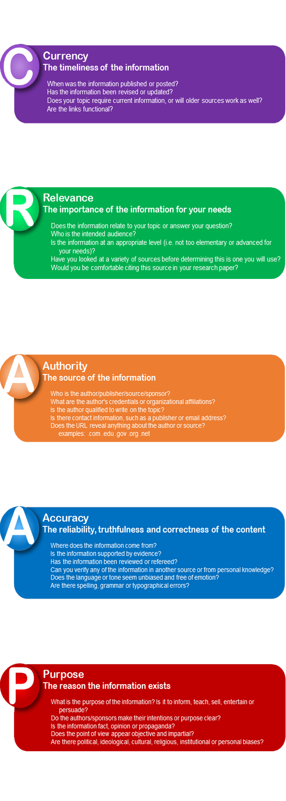

# Quality of CTI

The quality of CTI can be assessed by how well it enables an organization to proactively defend against potential cyber threats and respond effectively to actual incidents. Measuring the quality of CTI involves evaluating several factors, such as:
{ width="380" align=right }
### Relevance
 The intelligence should be relevant to the organization and its industry, as well as specific to the threats it faces.
### Timeliness 
The intelligence should be timely and up-to-date, as threats can evolve and change rapidly.
### Accuracy 
The intelligence should be accurate and reliable, based on credible sources and validated information.
### Completeness
The intelligence should provide a complete picture of the threat, including the tactics, techniques, and procedures used by the threat actors.
### Actionability 
The intelligence should be actionable, meaning that it provides specific recommendations or actions that can be taken to mitigate or prevent the threat.
### Usability 
The intelligence should be presented in a format that is easy to understand and use, and can be integrated into existing security systems.
### Confidence Levels 
The measured intelligence quality must reflect the accuracy and reliability of the information, based on source credibility, data quality, and corroboration. High levels indicate reliability, while low levels indicate caution