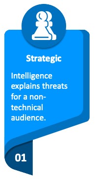
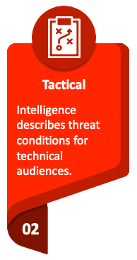
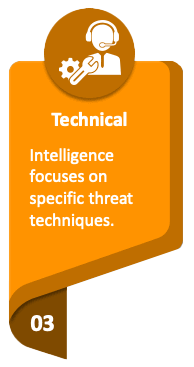
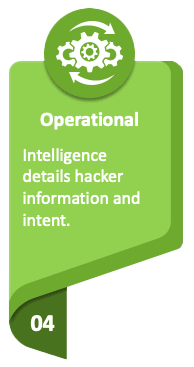

# CTI Classification

CTI classification is the process of categorizing intelligence based on various attributes, such as the type of threat actor, the nature of the threat, the severity of the impact, and the relevance to the organization.
CTI can be classified into the following categories:

{ width="120" align=left }

### Strategic Intelligence 

high-level intelligence used to inform security decisions and investments. Strategic CTI provides a big-picture view of the threat landscape and helps executives and decision-makers make informed decisions about security strategies and investments. Strategic CTI is often based on long-term trends and analysis of the geopolitical landscape, cybercriminal activity, and emerging technologies.
 
 

{ width="120" align=left }

### Tactical Intelligence 

This type of intelligence is used to respond quickly to active threats and attacks. Tactical CTI is often shared in real-time and contains specific details about the tactics, techniques, and procedures (TTPs) of threat actors. This type of intelligence helps security teams take immediate action to prevent or stop attacks.
 
 
 

{ width="120" align=left }

### Technical Intelligence 

Intelligence focused on technical details of threats, such as malware analysis, exploit development, and vulnerability assessments. Technical CTI is often used by security researchers, incident response teams, and other technical security professionals to understand the inner workings of threats and develop effective countermeasures.
 
 
 

{ width="120" align=left }

### Operational Intelligence 

Operational intelligence is used to support ongoing security operations. Operational CTI is often shared on a regular basis and contains information about emerging threats, vulnerabilities, and other security risks. This type of intelligence helps organizations improve their overall security posture by providing valuable insights into the threat landscape.