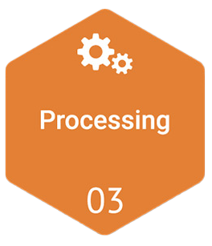
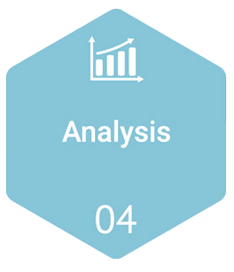
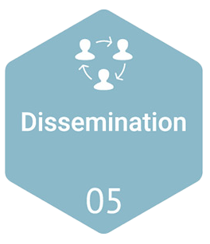
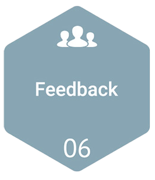

# CTI Lifecycle
The intelligence lifecycle is a process to transform raw data into finished intelligence for decision making and action. You will see many slightly different versions of the intelligence cycle in your research, but the goal is the same, to guide a cybersecurity team through the development and execution of an effective threat intelligence program.
Threat intelligence is challenging because threats are constantly evolving – requiring businesses to quickly adapt and take decisive action. The intelligence cycle provides a framework to enable teams to optimize their resources and effectively respond to the modern threat landscape. This cycle consists of six steps resulting in a feedback loop to encourage continuous improvement:

## Planning and Direction
{ width="100" align=left }
In this stage, the organization establishes the objectives and goals of its cyber threat intelligence program. This includes defining the scope of the program, determining the types of threats and intelligence that are relevant to the organization, and identifying the sources of intelligence to be collected. It also involves setting up processes for data collection, analysis, and dissemination, and defining roles and responsibilities for managing the intelligence.

## Collection
{ width="100" align=left }
In this stage, data is collected from various sources, such as internal security logs, external threat intelligence feeds, open source intelligence (OSINT), dark web monitoring, and other relevant sources. This stage involves gathering raw data that may contain indicators of compromise (IOCs), such as IP addresses, domain names, hashes, and other information that may be indicative of potential cyber threats. The collected data is then stored and managed for further analysis.

## Processing
{ width="100" align=left }
Once the data is collected, it needs to be processed to identify relevant information and eliminate noise. This stage involves cleaning, normalizing, and enriching the data to ensure its accuracy and reliability. It may also involve correlating the data with existing intelligence and contextualizing it to provide meaningful insights. This stage is crucial for preparing the data for analysis and making it ready for further use.

## Analysis
{ width="100" align=left }
In this stage, the processed data is analyzed to identify patterns, trends, and potential threats. This involves using various analytical techniques, such as data mining, machine learning, and human expertise, to identify potential cyber threats, their motivations, and tactics. The goal is to derive actionable intelligence that can be used to make informed decisions. Analysis may involve identifying new or emerging threats, assessing the severity and impact of threats, and providing context around threat actors and their capabilities.

## Dissemination
{ width="100" align=left }
Once the intelligence is analyzed and validated, it needs to be shared with relevant stakeholders. This stage involves disseminating the intelligence to appropriate recipients, such as security analysts, incident responders, and decision-makers, through reports, alerts, and other communication channels. It is important to ensure that the intelligence is presented in a clear, concise, and actionable manner, with relevant context, so that stakeholders can effectively use it to improve their cybersecurity posture.

## Feedback and Update
{ width="100" align=left }
This stage involves gathering feedback from stakeholders and incorporating it into the cyber threat intelligence program. This may include feedback on the quality and relevance of the intelligence, as well as suggestions for improvements. Based on the feedback and changing threat landscape, the program may need to be updated, such as refining the collection sources, analysis techniques, or dissemination processes. This stage ensures that the intelligence program remains effective and aligned with the organization's cybersecurity needs.
