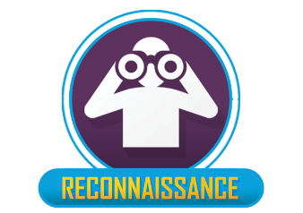
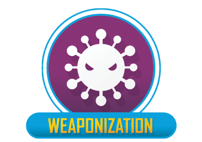
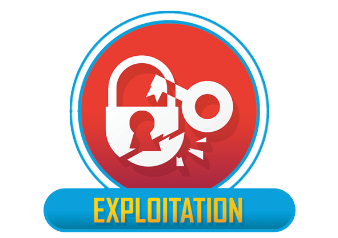
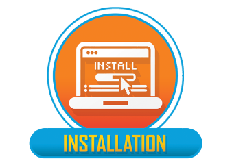
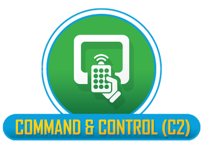
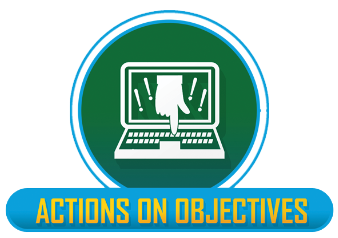

# Cyber Kill Chain

The Cyber Kill Chain, developed by Lockheed Martin, is a concept used in cybersecurity to describe the stages of a typical cyber attack, from the initial reconnaissance by an attacker to the final exploitation of a target system. It is often used as a framework to understand and defend against cyber attacks, and it typically consists of the following stages:

### Reconnaissance
{ width="140" align=left }
In this stage, the attacker gathers information about the target system or network. This may involve researching potential targets, identifying vulnerabilities in the target's infrastructure, and gathering data through various methods such as open-source intelligence (OSINT) gathering, scanning, or probing.

### Weaponization
{ width="140" align=left }
Once the attacker has identified vulnerabilities in the target system, they create or acquire a "weapon"(or weaponizer), which combines malware and exploit into a deliverable payload. This weapon is typically designed to gain unauthorized access or execute malicious actions on the target system.

### Delivery
{ width="140" align=left }
In this stage, the attacker delivers the weapon to the target system. This may involve sending a malicious email, exploiting a vulnerability in a web application, or using other means to gain entry into the target system or network.
 

### Exploitation
{ width="140" align=left }
Once the weapon is delivered, it is used to exploit the identified vulnerabilities in the target system. This could involve executing code, leveraging privilege escalation techniques, or manipulating system configurations to gain unauthorized access.

### Installation
{ width="140" align=left }
After gaining access, the attacker installs and executes the malware or other tools to establish a persistent presence in the target system. This may involve creating backdoors, setting up remote access, or installing other malicious software that allows for further control and access to the compromised system.

### Command and Control (C2)
{ width="140" align=left }
In this stage, the attacker establishes communication channels and remote control mechanisms to maintain control over the compromised system. This may involve setting up command-and-control servers, creating hidden channels, or using other methods to maintain communication and control over the compromised system.

### Actions on Objectives
{ width="140" align=left }
Finally, the attacker takes action on their ultimate goal, which could vary depending on their motivations. This could involve data theft, system disruption, financial gain, or other malicious activities, depending on the attacker's objectives.
