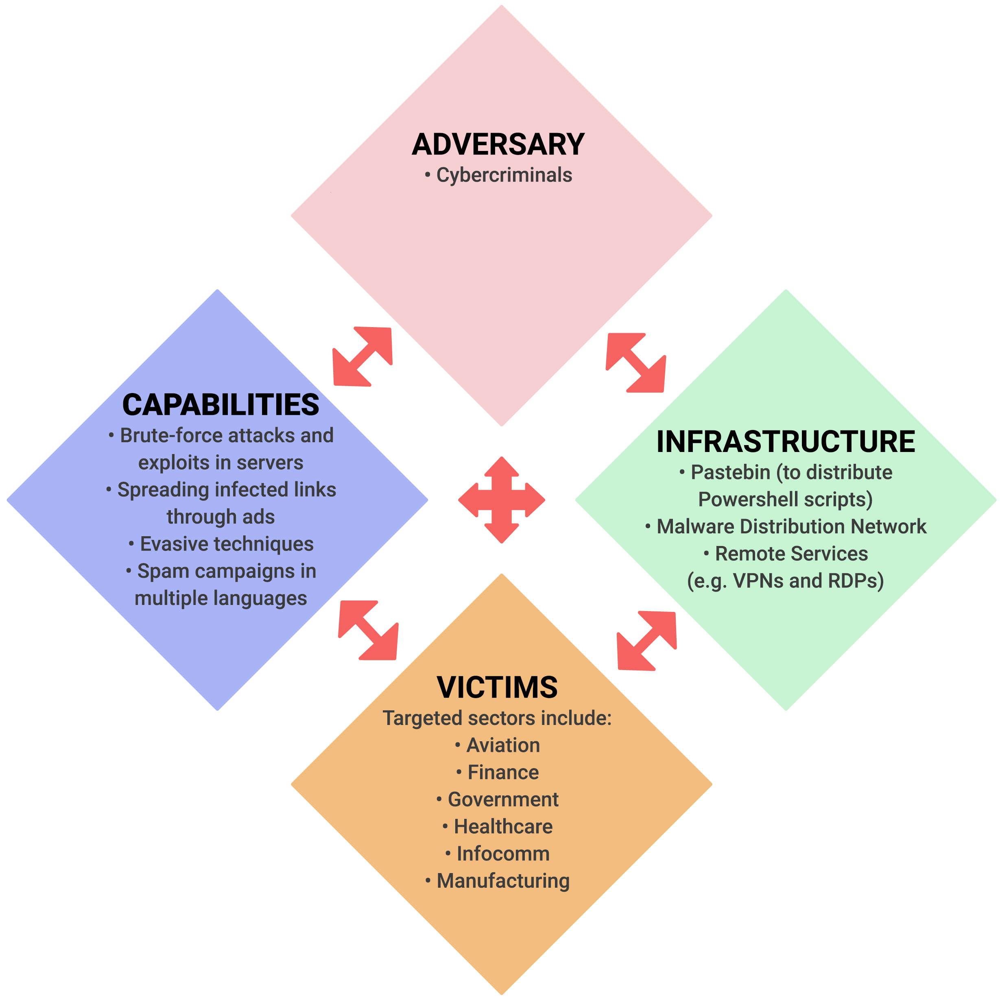

# Diamond Model

The Diamond Model of Intrusion Analysis, developed by cybersecurity professionals Sergio Caltagirone, Andrew Pendergast, and Christopher Betz, is composed of four core elements: Adversary, Infrastructure, Capability, and Victim, arranged in the shape of a diamond. It allows for flexibility and integration of intelligence in real-time for network defense, event correlation, classification of events into adversary campaigns, and forecasting adversary operations. Learning about the Diamond Model can help identify elements of an intrusion, analyze APTs, and explain events to non-technical individuals. 

{ width=400 align=right }

### Adversary

Adversary is the person or organization responsible for conducting a cyberattack against a victim. Adversary knowledge is often unknown initially, and it is important to differentiate between the adversary operator who conducts the intrusion activity, and the adversary customer who benefits from it. Identifying the adversary can be challenging, but relevant data can help determine their identity.

### Victim

Victim refers to the target of the adversary in a cyberattack, which could be an organization, person, email address, IP address, domain, etc. It's important to differentiate between victim personae (people and organizations being targeted) and victim assets (systems, networks, accounts, etc. being attacked). Understanding the victim persona and victim assets helps in analyzing the attack and identifying the targets of interest for the adversary.

### Capability

Capability refers to the skills, tools, and techniques used by the adversary in a cyberattack, including their tactics, techniques, and procedures (TTPs). It encompasses a range of techniques, from less sophisticated methods like manual password guessing to more advanced techniques such as developing malware or malicious tools. Capability capacity refers to the vulnerabilities and exposures that a specific capability can exploit.

### Infrastructure

Infrastructure represents the systems and networks used by the adversary to manage and control the attack. This can include command-and-control (C2) servers, botnets, or other communication channels used to maintain control over the compromised system. Understanding the infrastructure used by the adversary can help organizations detect and disrupt the attack by identifying and blocking C2 communication channels.

### Meta-Features for the Diamond Model:

* **Timestamp**
Date and time of the event, essential for determining patterns and grouping malicious activity.

* **Phase**
Phases of an intrusion, attack, or breach, such as reconnaissance, weaponization, delivery, exploitation, installation, command & control, and actions on objective.

* **Result**
Outcome or post-conditions of an adversary's operations, labeled as success, failure, unknown, or related to the CIA triad (confidentiality, integrity, availability).

* **Direction**
Direction of the intrusion attack, such as victim-to-infrastructure, infrastructure-to-victim, infrastructure-to-infrastructure, adversary-to-infrastructure, infrastructure-to-adversary, bidirectional, or unknown.

* **Methodology**
General classification of intrusion, e.g., phishing, DDoS, breach, port scan, etc.

* **Resources**
External resources needed for a successful intrusion event, such as software, knowledge, information, hardware, funds, facilities, and access.

* **Social-Political Component**
The Social-Political aspect of the adversary includes their goals such as financial gain, hacker community recognition, hacktivism, or espionage. The victim may unknowingly provide computing resources and bandwidth for crypto mining as a zombie in a botnet, while the adversary benefits financially or consumes the victim's product.

* **Technology**
Technology focuses on the relationship between capability and infrastructure. Capability and infrastructure determine how the adversary operates and communicates. For instance, in a watering-hole attack, the adversary compromises legitimate websites that they expect their intended victims to visit.
