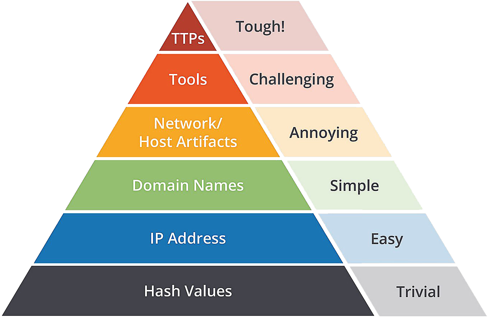

# The Pyramid of Pain

The Pyramid of Pain was developed by security expert David J. Bianco in 2013. It illustrates that certain indicators of a compromise carry greater significance for adversaries than others. Denying these indicators to an attacker inflicts a higher level of discomfort, as the loss of some indicators is more “painful” than the loss of others.

As outlined by David J Bianco himself, the Pyramid stages are:

{ width="420" align=right }

### Hash Values

A hash value, also known as a hash code or checksum, is a fixed-size alphanumeric string of characters that represents the output of a hash function applied to a set of data. It's used as a digital fingerprint to verify data integrity.
Hash values are used by security professionals to gain insight into malware samples and uniquely identify malicious artifacts. Hash lookups can be done using online tools like VirusTotal and Metadefender Cloud - OPSWAT.

### IP Addresses

IP addresses are important for identifying devices on a network. Defense tactics often involve blocking or denying inbound requests from IP addresses, but this can be bypassed using techniques like Fast Flux. Fast Flux is a DNS technique used by botnets to hide malicious activities behind compromised hosts acting as proxies. It involves having multiple IP addresses associated with a constantly changing domain name, making it challenging to be discovered by security professionals.

### Domain names

Attackers may use malicious domain names for Command and Control (C2) infrastructure, and one example is Punycode attacks where non-ASCII words are converted into Unicode ASCII encoding to create seemingly legitimate domains. Attackers may also hide malicious domains using URL shorteners, which create short and unique URLs that redirect to specific websites. Common URL shortening services used by attackers include bit.ly, goo.gl, ow.ly, s.id, smarturl.it, tiny.pl, tinyurl.com, and x.co. To reveal the actual website behind a shortened URL, one can append "+" to it in the address bar of a web browser.

### Host Artifacts

Host artifacts are traces left by attackers on a system, such as registry values, processes, or files. Detecting host artifacts disrupts attackers and forces them to change tactics, adding time and resources to their attack. This helps defenders identify and respond to attacks effectively, making it harder for attackers to maintain persistence.

### Network Artifacts

Network artifacts, such as user-agent strings, C2 information, or URI patterns in HTTP POST requests, can be important indicators of a threat. Detecting network artifacts can disrupt an attacker's tactics, forcing them to modify their tools or tactics, giving defenders more time to respond and remediate threats. Network artifacts can be detected using network protocol analyzers like Wireshark or IDS logging from tools like Snort.

### Tools

Attackers commonly use utilities such as maldocs, backdoors, custom files, payloads, and password crackers. Antivirus signatures, detection rules, and YARA rules are effective against these threats. At this stage, detection capabilities against attacker tools are highly effective, causing the attacker to give up or invest significant resources in developing
new tools.

MalwareBazaar and Malshare offer access to malicious samples and YARA results for threat hunting and incident response. Fuzzy hashing, such as the use of SSDeep, is another powerful tool for similarity analysis and matching two files with minor differences based on fuzzy hash values.

### TTPs

TTPs (Tactics, Techniques, and Procedures), encompass the entire spectrum of steps taken by an adversary to achieve their goals, including activities such as phishing attempts, persistence, and data exfiltration. Detecting and responding to TTPs quickly can leave attackers with limited options for fighting back.
For example, detecting and remediating a Pass-the-Hash attack using Windows Event Log Monitoring can quickly identify and stop lateral movement within a network, forcing the attacker to either invest more time and resources in reconfiguring their tools or giving up and finding a different target.
