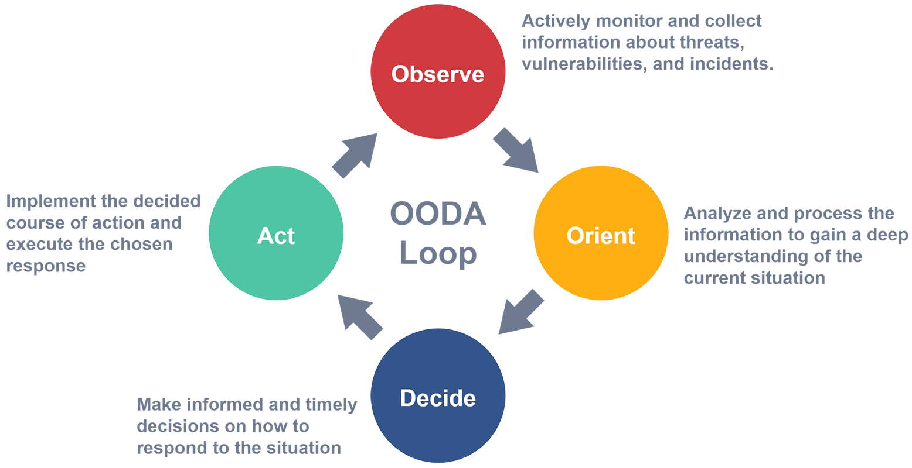

# OODA Loop
The OODA Loop is a decision-making framework that stands for Observe, Orient, Decide, and Act. It was developed by military strategist and United States Air Force Colonel John Boyd and has been widely adopted in various fields, including cybersecurity, as a way to rapidly respond to dynamic and changing situations. It is a continuous and iterative process, meaning that feedback from the actions taken is used to update situational awareness, and the process is repeated as needed.

{ width=900 }

### Observe

In this step, you actively gather information from various sources to understand the current situation. This can involve monitoring network traffic, analyzing logs, reviewing security alerts, and staying updated with the latest threat intelligence. The goal is to collect as much relevant data as possible to gain a clear understanding of the threat landscape.

### Orient

Once you have collected the information, you need to process and interpret it to gain situational awareness. This step involves analyzing the data in the context of your organization's environment, policies, procedures, and goals. It also involves considering factors such as the capabilities and motivations of potential adversaries, the impact of the threat on your systems and data, and the potential risks and consequences of different courses of action.

### Decide

Based on the situational awareness, you make informed decisions on how to respond to the threat. This step involves evaluating different options, considering their potential effectiveness, feasibility, and impact, and selecting the most appropriate course of action. It may also involve consulting with other stakeholders, such as IT teams, management, or legal departments, to make informed decisions.

### Act

After making a decision, you implement the chosen course of action promptly and effectively. This step involves deploying resources, implementing security measures, and taking necessary steps to counter the threat or resolve the situation. It's important to act decisively and efficiently to mitigate the risk and minimize potential damage.
