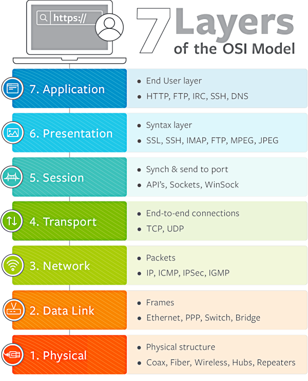

# Open Systems Interconnection (OSI) Model

The OSI model is a conceptual framework used to describe how data is transmitted over a network. It divides the process of communication into several layers, each with its own specific function. The model helps to ensure that different networking technologies can work together effectively by defining a common language for communication between devices on a network.

{ width="400" align=right }

### Application Layer: 7

The application layer is responsible for providing services directly to the end user. It provides an interface between the user and the network, and includes protocols such as HTTP, FTP, SMTP, and Telnet. These protocols allow applications to exchange data with each other over the network.

### Presentation Layer: 6

The presentation layer is responsible for transforming data into a format that can be understood by the application layer. It includes protocols such as encryption, decryption, compression, and decompression. These protocols ensure that data is transmitted in a format that can be understood by the receiving application.

### Session Layer: 5

The session layer is responsible for establishing, maintaining, and terminating connections between applications. It includes protocols such as NetBIOS and RPC (Remote Procedure Call). These protocols allow applications to communicate with each other by establishing a session and exchanging data.

### Transport Layer: 4

The transport layer is responsible for providing reliable delivery of data between end systems. It includes protocols such as TCP (Transmission Control Protocol) and UDP (User Datagram Protocol). TCP provides reliable, connection-oriented delivery of data, while UDP provides unreliable, connectionless delivery of data.

### Network Layer: 3

The network layer is responsible for providing end-to-end packet delivery across multiple networks. It includes protocols such as IP (Internet Protocol), which is used to route packets across different networks.

### Data Link Layer: 2

The data link layer is responsible for providing error-free transfer of data frames between adjacent nodes on a network. It includes protocols such as Ethernet and Wi-Fi, which provide access to the physical medium, and also includes mechanisms for error detection and correction.

### Physical Layer: 1

The physical layer is responsible for transmitting raw bit streams over a physical medium, such as copper or fiber optic cable. It defines characteristics such as voltage levels, physical connectors, and the way in which data is transmitted over the medium.
