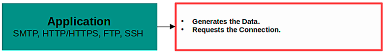
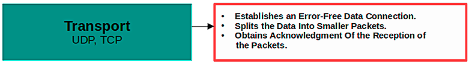
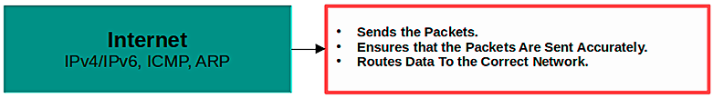
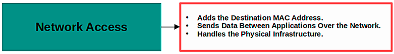

# Transmission Control Protocol/Internet Protocol (TCP/IP)

The TCP/IP model is a networking model used to describe how data is transmitted over the internet. It consists of four layers: the Application layer, the Transport layer, the Internet layer, and the Network Access layer.

### Application Layer

The Application layer is where software applications, such as web browsers or email clients, communicate with each other over the network. This layer defines the protocols used by these applications, such as HTTP for web browsing or SMTP for email.

### Transport Layer

The Transport layer is responsible for ensuring that data is transmitted reliably between applications. This layer defines the TCP and UDP protocols, which are used to establish connections, break data into packets, and ensure that packets are delivered in order and without errors.

### Internet Layer

The Internet layer is responsible for routing data across networks. This layer defines the IP protocol, which is used to address and route packets of data between networks.

### Network Access (or Link) Layer

The Network Access layer is responsible for transmitting data over the physical network. This layer defines the protocols used to transmit data over specific types of networks, such as Ethernet or Wi-Fi.
